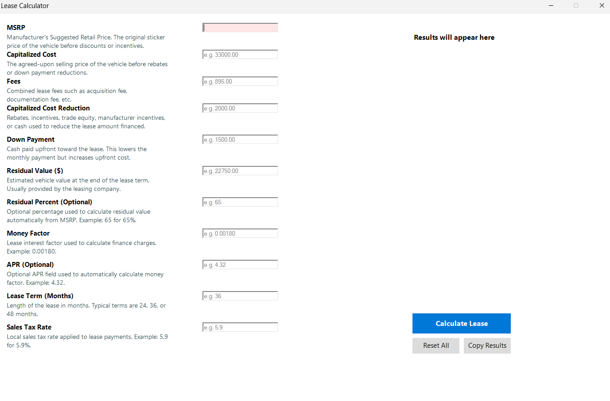

# Lease Calculator

A Windows desktop lease calculator built in PowerShell using Windows Forms. Designed for anyone evaluating car lease deals — plug in the numbers from a dealer worksheet and instantly see your monthly payment breakdown.


## Features

- **Full lease payment breakdown** — Net Capitalized Cost, depreciation, finance charge, monthly payment before/after tax, and total lease cost
- **Auto-sync fields** — APR ↔ Money Factor and Residual % ↔ Residual $ automatically populate each other
- **Input validation** — Fields highlight red on invalid input; strips `$`, `,`, and `%` characters automatically
- **Placeholder text** — Example values shown in each field so you know the expected format
- **Copy to clipboard** — One click to copy your results
- **Reset** — Clear all fields and start a new calculation

## Screenshot

<!-- Add a screenshot of the calculator here -->


## Requirements

- Windows 10/11
- PowerShell 5.1 or later (pre-installed on Windows 10/11)

## Usage

### Option 1: Launch script
1. Click "LAUNCH_LEASECALCULATOR.bat"

### Option 2: Terminal
```powershell
powershell -ExecutionPolicy Bypass -File .\LeaseCalculator.ps1
```

> **Note:** If you get an execution policy error, the `-ExecutionPolicy Bypass` flag handles it. This only applies to the current session and doesn't change your system settings.

## Fields

| Field | Required | Description |
|---|---|---|
| MSRP | Yes | Manufacturer's Suggested Retail Price |
| Capitalized Cost | Yes | Agreed-upon selling price of the vehicle |
| Fees | No | Acquisition fee, doc fee, etc. (defaults to 0) |
| Capitalized Cost Reduction | No | Rebates, incentives, trade equity (defaults to 0) |
| Down Payment | No | Cash paid upfront (defaults to 0) |
| Residual Value ($) | One required | Vehicle value at lease end |
| Residual Percent | One required | Residual as a percentage of MSRP |
| Money Factor | One required | Lease interest factor (e.g., 0.00180) |
| APR | One required | Annual percentage rate (e.g., 4.32) |
| Lease Term | Yes | Length in months (12–84) |
| Sales Tax Rate | Yes | Local tax rate as a percentage (e.g., 5.9) |

"One required" means you need either field in the pair — the other auto-calculates.

## How the Math Works

```
Net Capitalized Cost = Capitalized Cost + Fees − Cap Cost Reduction − Down Payment
Depreciation / mo   = (Net Cap Cost − Residual Value) / Term
Finance Charge / mo  = (Net Cap Cost + Residual Value) × Money Factor
Monthly Payment      = Depreciation + Finance Charge
Monthly w/ Tax       = Monthly Payment × (1 + Tax Rate)
Total Lease Cost     = (Monthly w/ Tax × Term) + Down Payment
```

### APR ↔ Money Factor Conversion

```
Money Factor = APR / 2400
APR = Money Factor × 2400
```

## Tips

- **Matching a dealer worksheet:** The "Capitalized Cost" field corresponds to the "Agreed Upon Value of Vehicle" on most lease worksheets. If the worksheet's Gross Capitalized Cost already includes fees, enter that as Cap Cost and leave Fees at 0.
- **Small differences from worksheets:** The calculator uses the standard lease formula. Dealer worksheets may show $1–2/mo difference due to internal rounding of the rent charge. This is normal.
- **Comparing deals:** Use the Total Lease Cost to compare different lease offers apples-to-apples, since a lower monthly payment with a higher down payment isn't always a better deal.

## License

MIT License — free to use, modify, and distribute.
